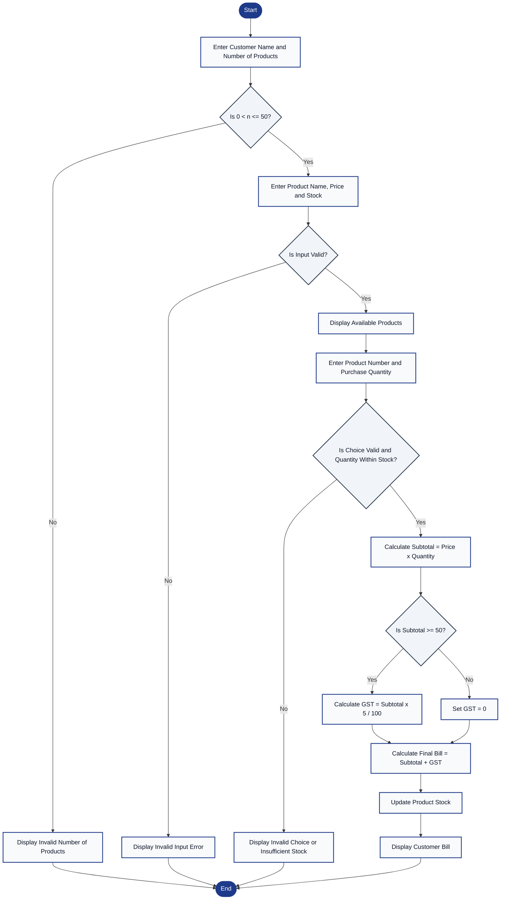

## Flowchart

```mermaid
flowchart TD
    A([Start]) --> B[Enter Customer Name and Number of Products]
    B --> C{Is 0 < n <= 50?}

    C -->|No| D[Display Invalid Number of Products]
    D --> Z([End])

    C -->|Yes| E[Enter Product Name, Price and Stock]
    E --> F{Is Input Valid?}

    F -->|No| G[Display Invalid Input Error]
    G --> Z

    F -->|Yes| H[Display Available Products]
    H --> I[Enter Product Number and Purchase Quantity]
    I --> J{Is Choice Valid and Quantity Within Stock?}

    J -->|No| K[Display Invalid Choice or Insufficient Stock]
    K --> Z

    J -->|Yes| L[Calculate Subtotal = Price x Quantity]
    L --> M{Is Subtotal >= 50?}

    M -->|Yes| N[Calculate GST = Subtotal x 5 / 100]
    M -->|No| O[Set GST = 0]

    N --> P[Calculate Final Bill = Subtotal + GST]
    O --> P

    P --> Q[Update Product Stock]
    Q --> R[Display Customer Bill]
    R --> Z

    classDef process fill:#f8fafc,stroke:#1e3a8a,stroke-width:2px,color:#0f172a;
    classDef decision fill:#f1f5f9,stroke:#334155,stroke-width:2px,color:#0f172a;
    classDef terminal fill:#1e3a8a,stroke:#1e3a8a,stroke-width:2px,color:#ffffff;

    class B,E,H,I,L,N,O,P,Q,R,D,G,K process;
    class C,F,J,M decision;
    class A,Z terminal;
```